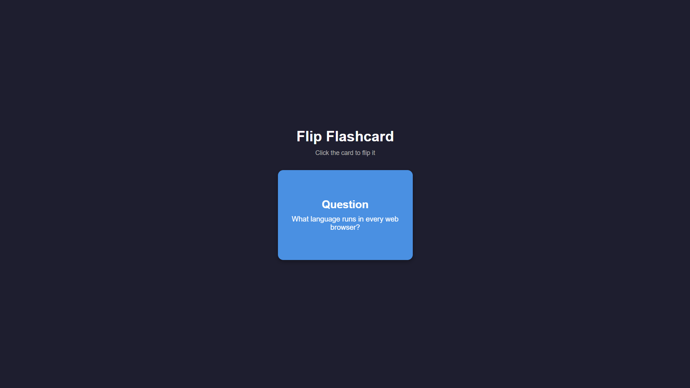
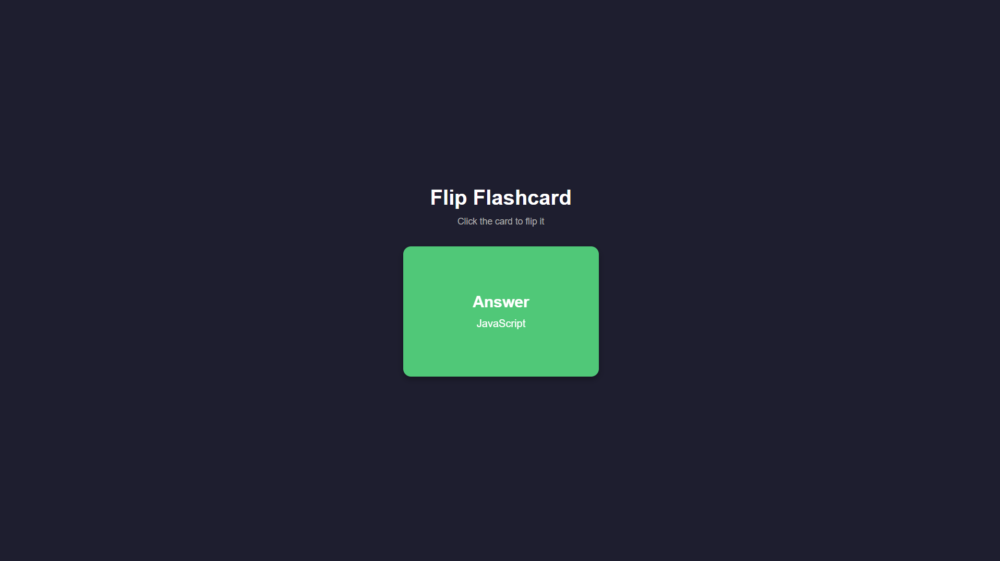

# Flip Flashcard

A simple flashcard built with just HTML & CSS. Click the card to flip between the question (front) and the answer (back) — powered entirely by CSS 3D transforms, no JavaScript required.

🔗 **Repository:** [github.com/piratheepan96/flip-flashcard](https://github.com/piratheepan96/flip-flashcard)

## 🔗 Live Demo
[View Live Demo](https://piratheepan96.github.io/flip-flashcard/)

## 📸 Preview

**Front (Question)**


**Back (Answer)**


## Features
- Pure HTML & CSS (no JavaScript)
- Smooth 3D flip animation on click
- Simple, beginner-friendly code structure

## Tech Stack
- HTML5
- CSS3 (Flexbox, 3D Transforms, Transitions)

## Getting Started
1. Clone this repo
   ```bash
   git clone https://github.com/piratheepan96/flip-flashcard.git
   ```
2. Open `index.html` in your browser

## What I Learned
- How CSS `transform-style: preserve-3d` and `backface-visibility` work together
- Using the `:focus` state with `tabindex` to trigger animations without JS
- Basic responsive centering with Flexbox

## Author
[piratheepan96](https://github.com/piratheepan96)
